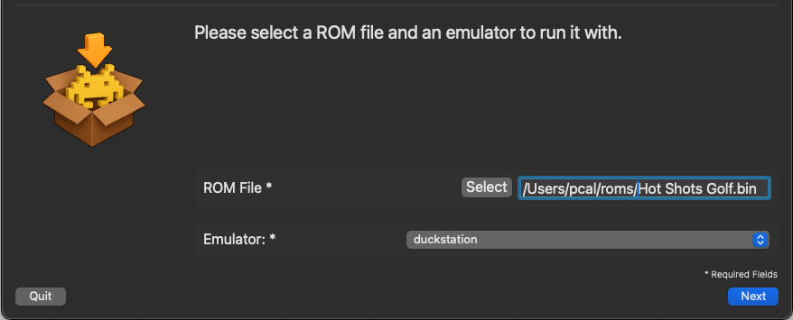
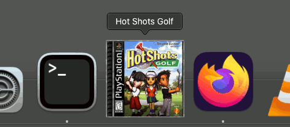

# RetroApp

**RetroApp** creates standalone MacOS desktop applications from 
retro game rom files.  Drag-and-drop a rom, out pops an app!

https://github.com/user-attachments/assets/49f888a9-b9ad-44bb-94b7-376bba11f4f3

## Features

* Create standalone retro game launchers for a variety of popular systems and emulators
* Automatically downloads box art for the game and creates a MacOS icon from it
* Fully sandboxes configuration files for each game (optional)
* Embeds the emulator for a truly standalone launcher (optional)

## Usage

* Drag a rom file onto RetroApp
* It creates standlone launcher app
* Click the launcher and play!

## Installation

* Download the [latest release](https://github.com/pcal43/RetroApp/releases)
* Open the `.dmg` and drag RetroApp into `/Applications`

...and out pops a self-contained MacOS app that runs your game.

See **Releases** to the right to download it yourself and give it a try!

## Feedback

RetroApp is still an alpha. I'm trying to get a sense of how much community 
interest there is in something like this before investing more time in it.

If you think it's a useful idea, come to my [discord channel](https://discord.pcal.net) 
and let me know!

---

## FAQ

### What systems are supported?

Here's the current list.  I'll be adding more if there's community interest.

| System | Emulator |
|--------|-------------|
| Atari - 2600 | stella |
| Coleco - ColecoVision | ares |
| Nintendo - Family Computer Disk System | nestopia |
| Nintendo - Game Boy | ares |
| Nintendo - Game Boy Advance | ares |
| Nintendo - Game Boy Color | ares |
| Nintendo - GameCube | dolphin |
| Nintendo - Nintendo 64 | ares |
| Nintendo - Nintendo 64DD | ares |
| Nintendo - Nintendo Entertainment System | ares |
| Nintendo - Super Nintendo Entertainment System | ares |
| Nintendo - Wii | dolphin |
| Sony - PlayStation | duckstation |
| Sony - PlayStation 2 | pcsx2 |

### Why would anyone want to use this?

RetroApp might be a good choice if:

* **You really only care about playing a few games.**  If you just have a dozen or 
so retro games that you care about playing regularly on your mac, you may 
find a small set of regular desktop applications easier to manage than
a full-features launcher.

* **You want to use Steam as your launcher for everything.**  Configuring
emulators as *Non-Steam Games* can be tedious; it's much easier to just point 
Steam at a desktop app.

* **You want to create easy-to-use launchers for kids** or other folks who 
aren't technically-savvy.

* **You want to separate config folders for each game.**  By default, RetroApps
are run in a sandboxed configuration directory - they have their own configuration
that is completely separate from other games using the same emulator.
This can be helpful if you want cleanly-separated settings and save files 
for each game. 

* You just think **having a bunch of Playstation discs in your MacOS Dock looks cool.**

If none of these apply to you, there lots of other launchers out there that
will probably work better for you, especially if you care about managing
a lot of ROMs.

### Won't this use up extra disk space?

Well, yes...but also a little bit no.  It's true that you end up with a 
copy of an emulator for each game.  But in many cases, it's not a huge 
amount of extra space, especially compared to the size of CD- and DVD- based roms.

Also, RetroApp uses 
[copy-on-write](https://bestreviews.net/the-magic-behind-apfs-copy-on-write/) 
when duplicating emulators and ROMs.  Which means that as long as they stay
on your computer, the extra 'copes' don't actually use any extra disk space!
However, as soon as you copy a RetroApp to a different computer, it will
be using up all of the space it says it is.

### Is there a command-line interface?

Yes, see `RetroApp.app/Contents/Resources/cli/retroapp.` If 
there is interest, I'll add support for installing it on your PATH properly.
