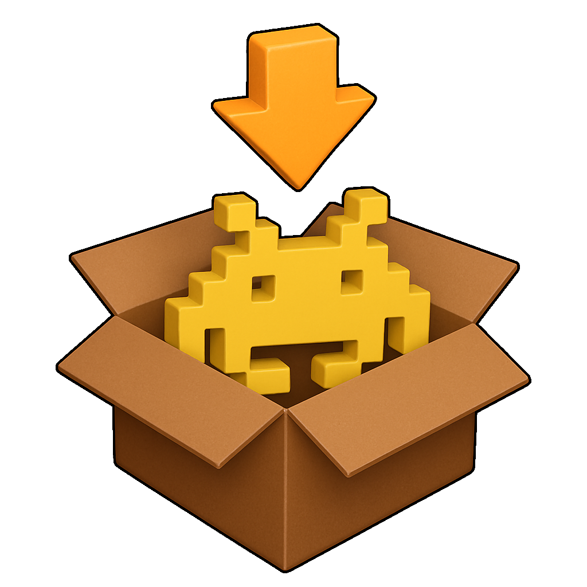

# RetroAppMaker

**RetroAppMaker** makes it easy to assemble standalone MacOS desktop 
applications for running retro games. 

You just give it 
* a ROM
* an emulator
* BIOS and config files 
* an icon image

...and out pops a self-contained MacOS app that runs your game.

See **Releases** to the right to download it yourself and give it a try!

*Note: RetroAppMaker is still in alpha testing.  It works but it's still in
the early stages.  I'm trying to get a sense of how much community interest 
there is in the project before investing more time in it.*

*If you think it's a useful idea, come to my [discord channel](https://discord.pcal.net) 
and let me know!*

---

### Why would anyone want to use this?

RetroAppMaker might be a good choice if:

* **You really only care about playing a few games.**  If you just have a dozen or 
so retro games that you care about playing regularly on your mac, you may 
find a small set of regular desktop applications easier to manage than
a full-features launcher.

* **You want to use Steam as your launcher for everything.**  Configuring
emulators as *Non-Steam Games* can be tedious; it's much easier to just point 
Steam at a desktop app.

* **You want to create easy-to-use launchers for kids** or other folks who 
aren't technically-savvy.

* **You want to separate config folders for each game.**  A RetroApp can 
optionally be configured to use its own directory under `Library/Application Support`.
This can be helpful if you want cleanly-separated settings and save files 
for each game.  *Note that this is not possible with all emulators*.

* You just think **having a bunch of Playstation discs in your MacOS Dock looks cool.**

If none of these apply to you, there lots of other launchers out there that
will probably work better for you, especially if you care about managing
a lot of ROMs.

### Won't this use up extra disk space?

Well, yes...but also a little bit no.  It's true that you end up with a 
copy of an emulator for each game.  But in many cases, it's not a huge 
amount of extra space, especially compared to the size of CD- and DVD- based roms.

Also, RetroAppMaker uses 
[copy-on-write](https://bestreviews.net/the-magic-behind-apfs-copy-on-write/) 
when duplicating emulators and ROMs.  Which means that as long as they stay
on your computer, the extra 'copes' don't actually use any extra disk space!
However, as soon as you copy a RetroApp to a different computer, it will
be using up all of the space it says it is.

### What emulators are supported?

* duckstation
* nestopia
* pcsx2
* stella

...and more coming soon!

### Is there a command-line interface?

Yes, see `RetroAppMaker.app/Contents/Resources/cli/retroapp.` If 
there is interest, I'll add support for installing it on your PATH properly.